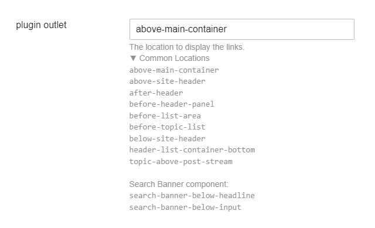
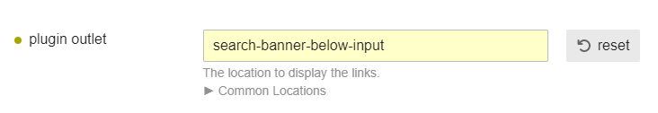

# Banner Featured Links

## Summary

Banner Featured Links allows you to create a banner of links.
It provides a wide range of customization options.

It's a feature inspired by the "Meta Brand" Discourse theme.

## Features

The default look – it uses the theme color.


Button can be styled separately:


You can place the links at various places via the `plugin outlet` setting.
A list of common locations is provided in the description. 


*I recommend using the [Plugin Outlet Locations](https://meta.discourse.org/t/plugin-outlet-locations-theme-component/100673) theme component to see where the plugin outlets are located.*

Example: if you want to mimic Meta Brand theme, you can use the `search-banner-below-input` outlet.
It assumes you have installed the [Search Banner](https://meta.discourse.org/t/search-banner-theme-component/122939) component.

 


<details>
<summary>Details</summary>


The current style can be achieved in the following way.
Here are the settings:


I encourage you to try your own style!
</details>

## Settings
 
### General

| Name    | Description                               |
| ------- | ----------------------------------------- |
| `links` | Text links to be displayed in the header. |
| `show_for_members` | Display the links for logged-in users. |
| `show_for_anon` | Display the links for anonymous users. |
| `display_on_mobile` | Display the links on mobile devices. |
| `display_on_desktop` | Display the links on desktop computers. |
| `display on homepage` | Displays the links on the homepage. |
| `url must contain` | Enter paths that should display the banner. Add <code>\*</code> to the end of the path as a wildcard. |
| `plugin outlet` | The location to display the links.<br><details><summary>Common Locations</summary><code>above-main-container</code><code>above-site-header</code><code>after-header</code><code>before-header-panel</code><code>before-list-area</code><code>before-topic-list</code><code>below-site-header</code><code>header-list-container-bottom</code><code>topic-above-post-stream</code><br>Search Banner component:<br><code>search-banner-below-headline</code><code>search-banner-below-input</code></details> |

#### `links` setting:

| Name   | Description                                                                                                                                                                                                                                                                            |
| ------ | -------------------------------------------------------------------------------------------------------------------------------------------------------------------------------------------------------------------------------------------------------------------------------------- |
| Emoji  | The emoji to display for the links.<br><details><summary>Shortcuts</summary><div>Windows: <kbd>Win</kbd> + <kbd>.</kbd></div><div>Mac: <kbd>Cmd</kbd> + <kbd>Ctrl</kbd> + <kbd>Space</kbd></div><div>ChromeOS: <kbd>Launch</kbd> + <kbd>Shift</kbd> + <kbd>Space</kbd></div></details> |
| Title  | The title of the link.                                                                                                                                                                                                                                                                 |
| URL    | The URL to link to.                                                                                                                                                                                                                                                                    |
| Target | Opens the linked document:<br><code>\_blank</code>: in a new window or tab (this is default)<br><code>\_self</code>: in the same frame as it was clicked<br><code>\_parent</code>: in the parent frame<br><code>\_top</code>: in the full body of the window.                          |

You can also style per-button. It will overwrite the global style.

| Name              | Description                                                                                                                                                                                                            |
| ----------------- | ---------------------------------------------------------------------------------------------------------------------------------------------------------------------------------------------------------------------- |
| Width             | The <a href="https://developer.mozilla.org/en-US/docs/Web/CSS/width" target="_blank" title="'width' CSS Documentation">width</a> of the button.<br>                                                                    |
| Font              | The <a href="https://developer.mozilla.org/en-US/docs/Web/CSS/font" target="_blank" title="'font' CSS Documentation">font</a> of the button.<br>                                                                       |
| Rounding          | The <a href="https://developer.mozilla.org/en-US/docs/Web/CSS/border-radius" target="_blank" title="'border-radius' CSS Documentation">amount of rounding</a> to apply to the button.                                  |
| Background        | The <a href="https://developer.mozilla.org/en-US/docs/Web/CSS/background-color" target="_blank" title="'background-color' CSS Documentation">background color</a> of the button.                                       |
| Background Hover` | The <a href="https://developer.mozilla.org/en-US/docs/Web/CSS/background-color" target="_blank" title="'background-color' CSS Documentation">background color</a> of the button when hovered.                          |
| Color`            | The text <a href="https://developer.mozilla.org/en-US/docs/Web/CSS/color" target="_blank" title="'color' CSS Documentation">color</a> of the button.                                                                   |
| Color Hover`      | The text <a href="https://developer.mozilla.org/en-US/docs/Web/CSS/color" target="_blank" title="'color' CSS Documentation">color</a> of the button when hovered.                                                      |
| Border            | The <a href="https://developer.mozilla.org/en-US/docs/Web/CSS/border" target="_blank" title="'border' CSS Documentation">border</a> of the button.                                                                     |
| Border Hover      | The <a href="https://developer.mozilla.org/en-US/docs/Web/CSS/border" target="_blank" title="'border' CSS Documentation">border</a> of the button when hovered.                                                        |
| Shadow            | The <a href="https://developer.mozilla.org/en-US/docs/Web/CSS/box-shadow" target="_blank" title="'box-shadow' CSS Documentation">shadow</a> of the button.                                                             |
| CSS Classname     | A custom CSS class to apply to the button.<br>Useful if you want to style the button differently and the settings are not enough.<br>You can target with <code>.banner-featured-links\_\_link.your-classname {}</code> |

### Global Styling

Customize the default spacing and look of the links.
You can overwrite the button styling for each link individually.

### Buttons Wrapper Styling

Customize the container of the links.

| Name                               | Description                                                                                                                                                                        |
| ---------------------------------- | ---------------------------------------------------------------------------------------------------------------------------------------------------------------------------------- |
| `buttons wrapper max width`        | The <a href="https://developer.mozilla.org/en-US/docs/Web/CSS/max-width" target="_blank" title="'max-width' CSS Documentation">maximum width</a> of the buttons wrapper.           |
| `buttons wrapper margin`           | The <a href="https://developer.mozilla.org/en-US/docs/Web/CSS/margin" target="_blank" title="'background-color' CSS Documentation">margin</a> of the buttons wrapper.              |
| `mobile buttons wrapper max width` | The <a href="https://developer.mozilla.org/en-US/docs/Web/CSS/max-width" target="_blank" title="'max-width' CSS Documentation">maximum width</a> of the buttons wrapper on mobile. |
| `mobile buttons wrapper margin`    | The <a href="https://developer.mozilla.org/en-US/docs/Web/CSS/margin" target="_blank" title="'background-color' CSS Documentation">margin</a> of the buttons wrapper on mobile.    |

### Buttons Spacing & Text Font Size

Customize the spacing of the buttons and the font size of the text.

| Name                       | Description                                                                                                                                                                                            |
| -------------------------- | ------------------------------------------------------------------------------------------------------------------------------------------------------------------------------------------------------ |
| `buttons justify`          | How to distribute <a href="https://developer.mozilla.org/en-US/docs/Web/CSS/justify-content" target="_blank" title="'justify-content' CSS Documentation">space</a> between and around links.           |
| `buttons gap`              | The <a href="https://developer.mozilla.org/en-US/docs/Web/CSS/gap" target="_blank" title="'gap' CSS Documentation">gap</a> between the buttons.                                                        |
| `buttons font`             | The <a href="https://developer.mozilla.org/en-US/docs/Web/CSS/font" target="_blank" title="'font' CSS Documentation">font</a> of the buttons.                                                          |
| `mobile buttons justify`   | How to distribute <a href="https://developer.mozilla.org/en-US/docs/Web/CSS/justify-content" target="_blank" title="'justify-content' CSS Documentation">space</a> between and around links on mobile. |
| `mobile buttons gap`       | The <a href="https://developer.mozilla.org/en-US/docs/Web/CSS/gap" target="_blank" title="'gap' CSS Documentation">gap</a> between the buttons on mobile.                                              |
| `mobile buttons direction` | The <a href="https://developer.mozilla.org/en-US/docs/Web/CSS/flex-direction" target="_blank" title="'flex-direction' CSS Documentation">direction</a> of the buttons on mobile.                       |
| `mobile buttons font`      | The <a href="https://developer.mozilla.org/en-US/docs/Web/CSS/font" target="_blank" title="'font' CSS Documentation">font</a> of the buttons on mobile.                                                |

### Buttons Spacing & Text Font Size

Customize the default look of the buttons.

| Name                      | Description                                                                                                                                                                                   |
| ------------------------- | --------------------------------------------------------------------------------------------------------------------------------------------------------------------------------------------- |
| `button width`            | The <a href="https://developer.mozilla.org/en-US/docs/Web/CSS/width" target="_blank" title="'width' CSS Documentation">width</a> of the button.<br>                                           |
| `button padding`          | The <a href="https://developer.mozilla.org/en-US/docs/Web/CSS/padding" target="_blank" title="'padding' CSS Documentation">padding</a> of the button.<br>                                     |
| `button rounding`         | The <a href="https://developer.mozilla.org/en-US/docs/Web/CSS/border-radius" target="_blank" title="'border-radius' CSS Documentation">amount of rounding</a> to apply to the button.         |
| `button background`       | The <a href="https://developer.mozilla.org/en-US/docs/Web/CSS/background-color" target="_blank" title="'background-color' CSS Documentation">background color</a> of the button.              |
| `button background hover` | The <a href="https://developer.mozilla.org/en-US/docs/Web/CSS/background-color" target="_blank" title="'background-color' CSS Documentation">background color</a> of the button when hovered. |
| `button color`            | The text <a href="https://developer.mozilla.org/en-US/docs/Web/CSS/color" target="_blank" title="'color' CSS Documentation">color</a> of the button.                                          |
| `button colo hover`       | The text <a href="https://developer.mozilla.org/en-US/docs/Web/CSS/color" target="_blank" title="'color' CSS Documentation">color</a> of the button when hover.                               |
| `button border`           | The <a href="https://developer.mozilla.org/en-US/docs/Web/CSS/border" target="_blank" title="'border' CSS Documentation">border</a> of the button.                                            |
| `button border hover`     | The <a href="https://developer.mozilla.org/en-US/docs/Web/CSS/border" target="_blank" title="'border' CSS Documentation">border</a> of the button when hovered.                               |
| `button shadow`           | The <a href="https://developer.mozilla.org/en-US/docs/Web/CSS/box-shadow" target="_blank" title="'box-shadow' CSS Documentation">shadow</a> of the button.                                    |

## Advanced Customization

You can use the following CSS to customize further:

```css
.banner-featured-links {
  &__wrapper {

  }

  &__wrapper-links {

  }

  &__link {

  }
}
```

If you provide a customization per-button, you can provide a classname in he `CSS Classname` setting.


Then, you can target this way:

```css
.banner-featured-links {
  &__link.myclass {

  }
}
```

## Useful links

* Discourse core CSS variables: https://github.com/discourse/discourse/blob/main/app/assets/stylesheets/color_definitions.scss

## Credits

* Discourse for the idea
* [Don](https://meta.discourse.org/u/don) and [nolo](https://meta.discourse.org/u/nolo) -- They made an initial version; I took some of their ideas.